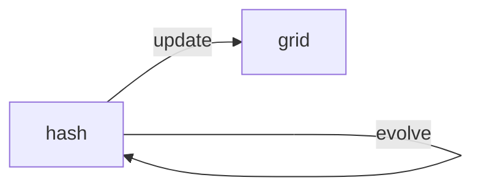
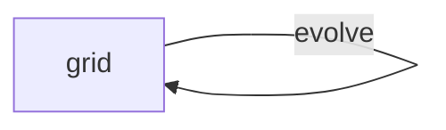

# Rules

<ol>
    <li>Any live cell with fewer than two live neighbours dies, as if by underpopulation.</li>
    <li>Any live cell with two or three live neighbours lives on to the next generation.</li>
    <li>Any live cell with more than three live neighbours dies, as if by overpopulation.</li>
    <li>Any dead cell with exactly three live neighbours becomes a live cell, as if by reproduction.</li>
</ol>

## Notes

<ul>
    <li>change randomness factor with range input</li>
    <li>change speed with range input</li>
    <li>alive : fixed color ; dead : black or background img with repeat</li>
    <li>implement memo neighbors to countAliveNeighbors for perf opti</li>
</ul>

#### Inputs

<ul>

</ul>

nAlive nDead nGen nSpeed nRandomness population size

// PlayPause => (play/pause switch icons)
Speed => range input (0-100) + label at left
range Add to Queue (x) => button to add x to queue
randomness factor => range input

button disabled Switch clocked => button & data

// button reset => button is data

save file ?
paint the grid?
typology open closed wrap

Cells :
Age => color

algo : read through hash to generate grid
hash evolve and than buildFromhash fn

evolve : count judge on hash and evolve hash mutate hash
update : grid from hash // copie grid
